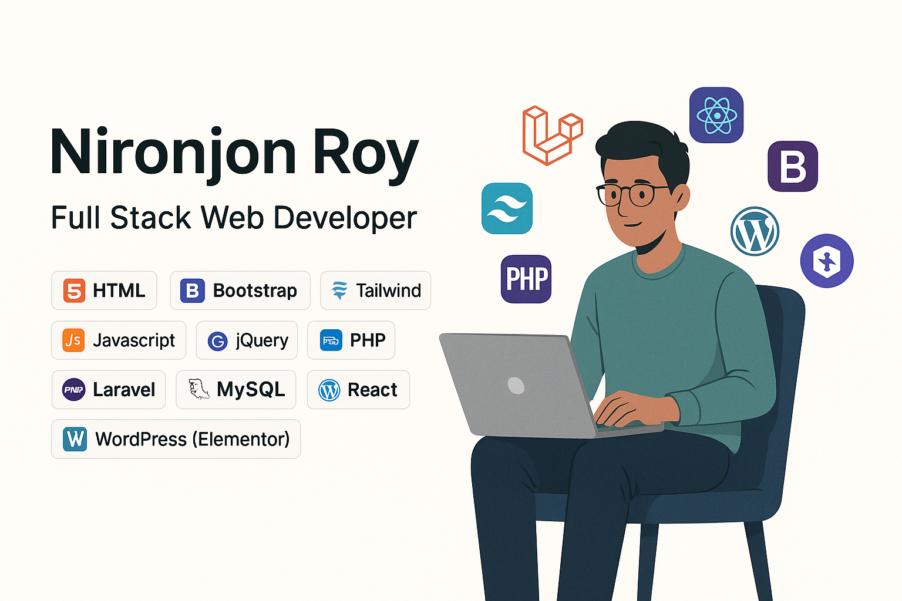

<!-- Typing Animation (will work properly on GitHub) -->

  

<!-- Your Profile Image -->

  

---

### 🧑‍💻 About Me

- 🌍 I'm based in **Rangpur, Bangladesh**
- 🔧 Tech Stack: `HTML`, `CSS`, `Bootstrap`, `Tailwind`, `JavaScript`, `PHP`, `Laravel`, `React`, `MySQL`
- 💡 Currently learning: **Tailwind CSS & Advanced Laravel**
- 🧠 Also skilled in: WordPress, Elementor, Figma, UI/UX
- 📬 Email: [nironjonroy.dev@gmail.com](mailto:nironjonroy.dev@gmail.com)
- 😄 Fun fact: I’m always coding with ☕ and memes 🤣

---

### 🚀 Tech Stack

**Frontend:**

**Backend:**

**Other Tools:**

---

### 📊 GitHub Stats

  <!-- GitHub Stats Image -->
  

  <!-- Trophy or Achievement Image -->
  

---

### 📫 Connect with Me

  
  
  
  
  

---

<i>🌱 "Keep learning, keep building!" – Roy</i>

